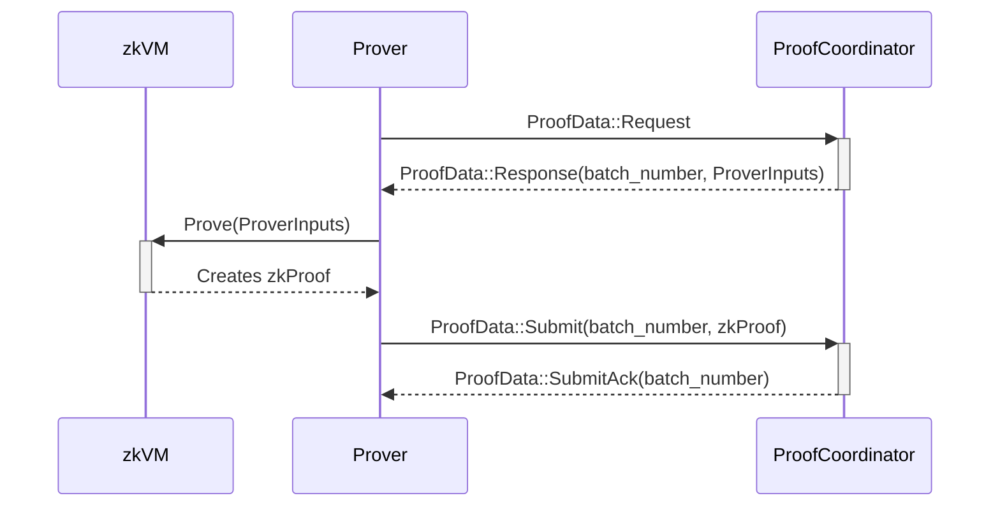

# ethrex L2 Prover

## Table of Contents

- [ethrex L2 Prover](#ethrex-l2-prover)
  - [Table of Contents](#table-of-contents)
  - [Intro](#intro)
  - [Workflow](#workflow)
  - [How](#how)
    - [Test](#test)
    - [L1 block proving](#l1-block-proving)
    - [Dev Mode](#dev-mode)
      - [Run the whole system with the prover - In one Machine](#run-the-whole-system-with-the-prover---in-one-machine)
    - [GPU mode](#gpu-mode)
      - [Proving Process Test](#proving-process-test)
      - [Run the whole system with a GPU Prover](#run-the-whole-system-with-a-gpu-prover)
  - [Configuration](#configuration)
  - [How it works](#how-it-works)
    - [Program inputs](#program-inputs)
      - [Execution witness](#execution-witness)
    - [Blocks execution program](#block-execution-program)
      - [Prelude 1: state trie basics](#prelude-1-state-trie-basics)
      - [Prelude 2: deposits, withdrawals and state diffs](#prelude-2-deposits-withdrawals-and-state-diffs)
      - [Step 1: initial state validation](#step-1-initial-state-validation)
      - [Step 2: blocks execution](#step-2-block-execution)
      - [Step 3: final state validation](#step-3-final-state-validation)
      - [Step 4: deposit hash calculation](#step-4-deposit-hash-calculation)
      - [Step 5: withdrawals Merkle root calculation](#step-5-withdrawals-merkle-root-calculation)
      - [Step 6: state diff calculation and commitment](#step-6-state-diff-calculation-and-commitment)

> [!NOTE]
> The shipping/deploying process and the `Prover` itself are under development.

## Intro

The prover consists of two main components: handling incoming proving data from the `L2 proposer`, specifically from the `ProofCoordinator` component, and the `zkVM`. The `Prover` is responsible for this first part, while the `zkVM` serves as a RISC-V emulator executing code specified in `crates/l2/prover/zkvm/interface/guest/src`.
Before the `zkVM` code (or guest), there is a directory called `interface`, which indicates that we access the `zkVM` through the "interface" crate.

In summary, the `Prover` manages the inputs from the `ProofCoordinator` and then "calls" the `zkVM` to perform the proving process and generate the `groth16` ZK proof.

## Workflow

The `ProofCoordinator` monitors requests for new jobs from the `Prover`, which are sent when the prover is available. Upon receiving a new job, the Prover generates the proof, after which the `Prover` sends the proof back to the `ProofCoordinator`.



## How

**Dependencies:**

- [RISC0](https://dev.risczero.com/api/zkvm/install)
  1. `curl -L https://risczero.com/install | bash`
  2. `rzup install cargo-risczero 1.2.0`
- [SP1](https://docs.succinct.xyz/docs/sp1/introduction)
  1. `curl -L https://sp1up.succinct.xyz | bash`
  2. `sp1up --version 5.0.0`
- [SOLC](https://docs.soliditylang.org/en/latest/installing-solidity.html)

After installing the toolchains, a quick test can be performed to check if we have everything installed correctly.

### L1 block proving

ethrex-prover is able to generate execution proofs of Ethereum Mainnet/Testnet blocks. An example binary was created for this purpose in `crates/l2/prover/bench`. Refer to its README for usage.

### Dev Mode

To run the blockchain (`proposer`) and prover in conjunction, start the `Prover`, use the following command:

```sh
make init-prover T="prover_type (risc0,sp1) G=true"
```

#### Run the whole system with the prover - In one Machine

> [!NOTE]
> Used for development purposes.

1. `cd crates/l2`
2. `make rm-db-l2 && make down`
   - It will remove any old database, if present, stored in your computer. The absolute path of libmdbx is defined by [data_dir](https://docs.rs/dirs/latest/dirs/fn.data_dir.html).
3. `make init`
   - Make sure you have the `solc` compiler installed in your system.
   - Init the L1 in a docker container on port `8545`.
   - Deploy the needed contracts for the L2 on the L1.
   - Start the L2 locally on port `1729`.
4. In a new terminal &rarr; `make init-prover T=(sp1,risc0)`.

After this initialization we should have the prover running in `dev_mode` &rarr; No real proofs.

### GPU mode

**Steps for Ubuntu 22.04 with Nvidia A4000:**

1. Install `docker` &rarr; using the [Ubuntu apt repository](https://docs.docker.com/engine/install/ubuntu/#install-using-the-repository)
   - Add the `user` you are using to the `docker` group &rarr; command: `sudo usermod -aG docker $USER`. (needs reboot, doing it after CUDA installation)
   - `id -nG` after reboot to check if the user is in the group.
2. Install [Rust](https://www.rust-lang.org/tools/install)
3. Install [RISC0](https://dev.risczero.com/api/zkvm/install)
4. Install [CUDA for Ubuntu](https://developer.nvidia.com/cuda-downloads?target_os=Linux&target_arch=x86_64&Distribution=Ubuntu&target_version=22.04&target_type=deb_local)
   - Install `CUDA Toolkit Installer` first. Then the `nvidia-open` drivers.
5. Reboot
6. Run the following commands:

```sh
sudo apt-get install libssl-dev pkg-config libclang-dev clang
echo 'export PATH=/usr/local/cuda/bin:$PATH' >> ~/.bashrc
echo 'export LD_LIBRARY_PATH=/usr/local/cuda/lib64:$LD_LIBRARY_PATH' >> ~/.bashrc
```

#### Run the whole system with a GPU Prover

Two servers are required: one for the `Prover` and another for the `sequencer`. If you run both components on the same machine, the `Prover` may consume all available resources, leading to potential stuttering or performance issues for the `sequencer`/`node`.

- The number 1 simbolizes a machine with GPU for the `Prover`.
- The number 2 simbolizes a machine for the `sequencer`/L2 node itself.

1. `Prover`/`zkvm` &rarr; prover with gpu, make sure to have all the required dependencies described at the beginning of [Gpu Mode](#gpu-mode) section.
   1. `cd ethrex/crates/l2`
   2. You can set the following environment variables to configure the prover:
      - PROVER_CLIENT_PROVER_SERVER_ENDPOINT: The address of the server where the client will request the proofs from
      - PROVER_CLIENT_PROVING_TIME_MS: The amount of time to wait before requesting new data to prove

- `Finally`, to start the `Prover`/`zkvm`, run:
  - `make init-prover T=(sp1,risc0) G=true`

2. `ProofCoordinator`/`sequencer` &rarr; this server just needs rust installed.
   1. `cd ethrex/crates/l2`
   2. Create a `.env` file with the following content:
   ```env
   // Should be the same as ETHREX_COMMITTER_L1_PRIVATE_KEY and ETHREX_WATCHER_L2_PROPOSER_PRIVATE_KEY
   ETHREX_DEPLOYER_L1_PRIVATE_KEY=<private_key>
   // Should be the same as ETHREX_COMMITTER_L1_PRIVATE_KEY and ETHREX_DEPLOYER_L1_PRIVATE_KEY
   ETHREX_WATCHER_L2_PROPOSER_PRIVATE_KEY=<private_key>
   // Should be the same as ETHREX_WATCHER_L2_PROPOSER_PRIVATE_KEY and ETHREX_DEPLOYER_L1_PRIVATE_KEY
   ETHREX_COMMITTER_L1_PRIVATE_KEY=<private_key>
   // Should be different from ETHREX_COMMITTER_L1_PRIVATE_KEY and ETHREX_WATCHER_L2_PROPOSER_PRIVATE_KEY
   ETHREX_PROOF_COORDINATOR_L1_PRIVATE_KEY=<private_key>
   // Used to handle TCP communication with other servers from any network interface.
   ETHREX_PROOF_COORDINATOR_LISTEN_ADDRESS=0.0.0.0
   // Set to true to randomize the salt.
   ETHREX_DEPLOYER_RANDOMIZE_CONTRACT_DEPLOYMENT=true
   // Check if the contract is deployed in your preferred network or set to `true` to deploy it.
   ETHREX_DEPLOYER_SP1_DEPLOY_VERIFIER=true
   // Check the if the contract is present on your preferred network.
   ETHREX_DEPLOYER_RISC0_CONTRACT_VERIFIER=<address>
   // It can be deployed. Check the if the contract is present on your preferred network.
   ETHREX_DEPLOYER_SP1_CONTRACT_VERIFIER=<address>
   // Set to any L1 endpoint.
   ETHREX_ETH_RPC_URL=<url>
   ```
   3. `source .env`

> [!NOTE]
> Make sure to have funds, if you want to perform a quick test `0.2[ether]` on each account should be enough.

- `Finally`, to start the `proposer`/`l2 node`, run:
  - `make rm-db-l2 && make down`
  - `make deploy-l1 && make init-l2`

## Configuration

Configuration is done through environment variables. The easiest way to configure the `Prover` is by creating a `prover_client_config.toml` file and setting the variables there. Then, at start, it will read the file and set the variables.

The following environment variables are available to configure the `Prover`, consider looking at the provided [prover_client_config_example.toml](../configs/prover_client_config_example.toml):

- `CONFIGS_PATH`: The path where the `PROVER_CLIENT_CONFIG_FILE` is located at.
- `PROVER_CLIENT_CONFIG_FILE`: The `.toml` that contains the config for the `Prover`.
- `PROVER_ENV_FILE`: The name of the `.env` that has the parsed `.toml` configuration.
- `PROVER_CLIENT_PROVER_SERVER_ENDPOINT`: Prover Server's Endpoint used to connect the Client to the Server.

The following environment variables are used by the ProverServer:

- `PROVER_SERVER_LISTEN_IP`: IP used to start the Server.
- `PROVER_SERVER_LISTEN_PORT`: Port used to start the Server.
- `PROVER_SERVER_VERIFIER_ADDRESS`: The address of the account that sends the zkProofs on-chain and interacts with the `OnChainProposer` `verify()` function.
- `PROVER_SERVER_VERIFIER_PRIVATE_KEY`: The private key of the account that sends the zkProofs on-chain and interacts with the `OnChainProposer` `verify()` function.

> [!NOTE]
> The `PROVER_SERVER_VERIFIER` account must differ from the `COMMITTER_L1` account.

## How it works

The prover's sole purpose is to generate a block (or batch of blocks) execution proof. For this, ethrex-prover implements a blocks execution program and generates a proof of it using different RISC-V zkVMs (SP1, Risc0).

The prover runs a process that polls another for new jobs. The job must provide the program inputs. A proof of the program's execution with the provided inputs is generated by the prover and sent back.

### Program inputs

The inputs for the blocks execution program (also called program inputs or prover inputs) are:

- the blocks to prove (header and body)
- the first block's parent header
- an execution witness
- the blocks' deposits hash
- the blocks' withdrawals Merkle root
- the blocks' state diff hash

The last three inputs are L2 specific.

These inputs are required for proof generation, but not all of them are committed as public inputs, which are needed for proof verification. The proof's public inputs (also called program outputs) will be:

- the initial state hash (from the first block's parent header)
- the final state hash (from the last block's header)
- the blocks' deposits hash
- the blocks' withdrawals Merkle root
- the blocks' state diff hash

#### Execution witness

The purpose of the execution witness is to allow executing the blocks without having access to the whole Ethereum state, as it wouldn't fit in a zkVM program. It contains only the state values needed during the execution.

An execution witness (represented by the `ProverDB` type) contains:
1. all the initial state values (accounts, code, storage, block hashes) that will be read or written to during the blocks' execution.
2. Merkle Patricia Trie (MPT) proofs that prove the inclusion or exclusion of each initial value in the initial world state trie.

An execution witness is created from a prior execution of the blocks. Before proving, we need to:

1. execute the blocks (also called "pre-execution").
2. log every initial state value accessed or updated during this execution.
3. store each logged value in an in-memory key-value database (`ProverDB`, implemented just using hash maps).
4. retrieve an MPT proof for each value, linking it (or its non-existence) to the initial state root hash.

Steps 1-3 are straightforward. Step 4 involves more complex logic due to potential issues when restructuring the pruned state trie after value removals. In sections [initial state validation](#step-1-initial-state-validation) and [final state validation](#step-3-final-state-validation) we explain what are pruned tries and in which case they get restructured.

If a value is removed during block execution (meaning it existed initially but not finally), two pathological cases can occur where the witness lacks sufficient information to update the trie structure correctly:

**Case 1**


Here, only **leaf 1** is part of the execution witness, so we lack the proof (and thus the node data) for **leaf 2**. After removing **leaf 1**, **branch 1** becomes redundant. During trie restructuring, it's replaced by **leaf 3**, whose path is the path of **leaf 2** concatenated with a prefix nibble (`k`) representing the choice taken at the original **branch 1**, and keeping **leaf 2**'s value.

```
branch1 = {c_1, c_2, ..., c_k, ..., c_16} # Only c_k = hash(leaf2) is non-empty
leaf2 = {value, path}
leaf3 = {value, concat(k, path)} # New leaf replacing branch1 and leaf2
```

Without **leaf 2**'s data, we cannot construct **leaf 3**. The solution is to fetch the _final_ state proof for the key of **leaf 2**. This yields an exclusion proof containing **leaf 3**. By removing the prefix nibble `k`, we can reconstruct the original path and value of **leaf 2**. This process might need to be repeated if similar restructuring occurred at higher levels of the trie.

**Case 2**

In this case, restructuring requires information about **branch/ext 2** (which could be a branch or extension node), but this node might not be in the witness. Checking the final **extension** node might seem sufficient to deduce **branch/ext 2** in simple scenarios. However, this fails if similar restructuring occurred at higher trie levels involving more removals, as the final **extension** node might combine paths from multiple original branches, making it ambiguous to reconstruct the specific missing **branch/ext 2** node.

The solution is to fetch the missing node directly using a `debug` JSON-RPC method, like `debug_dbGet` (or `debug_accountRange` and `debug_storageRangeAt` if using a Geth node).

> [!NOTE]
> These problems arise when creating the execution witness solely from state proofs fetched via standard JSON-RPC. In the L2 context, where we control the sequencer, we could develop a protocol to easily retrieve all necessary data more directly. However, the problems remain relevant when proving L1 blocks (e.g., for testing/benchmarking).

### Blocks execution program

The program leverages ethrex-common primitives and ethrex-vm methods. ethrex-prover implements a program that uses the existing execution logic and generates a proof of its execution using a zkVM. Some L2-specific logic and input validation are added on top of the basic blocks execution.

The following sections outline the steps taken by the execution program.

#### Prelude 1: state trie basics

We recommend learning about Merkle Patricia Tries (MPTs) to better understand this section.

Each executed block transitions the Ethereum state from an initial state to a final state. State values are stored in MPTs:

1. Each account has a Storage Trie containing its storage values.
2. The World State Trie contains all account information, including each account's storage root hash (linking storage tries to the world trie).

Hashing the root node of the world state trie generates a unique identifier for a particular Ethereum state, known as the "state hash".

There are two kinds of MPT proofs:

1. Inclusion proofs: Prove that `key: value` is a valid entry in the MPT with root hash `h`.
2. Exclusion proofs: Prove that `key` does not exist in the MPT with root hash `h`.
   These proofs allow verifying that a value is included (or its key doesn't exist) in a specific state.

#### Prelude 2: deposits, withdrawals and state diffs

These three components are specific additions for ethrex's L2 protocol, layered on top of standard Ethereum execution logic. They each require specific validation steps within the program.

For more details, refer to [Overview](overview.md), [Withdrawals](withdrawals.md), and [State diffs](state_diffs.md).

#### Step 1: initial state validation
The program validates the `ProverDB` by iterating over each provided state value (stored in hash maps) and verifying its MPT proof against the initial state hash (obtained from the first block's parent block header input). This is the role of the `verify_db()` function (to link the values with the proofs). We could instead directly decode the data from the MPT proofs on each EVM read/write, although this would incur performance costs.

Having the initial state proofs (paths from the root to each relevant leaf) is equivalent to having a relevant subset of the world state trie and storage tries – a set of "pruned tries". This allows operating directly on these pruned tries (adding, removing, modifying values) during execution.

#### Step 2: blocks execution

After validating the initial state, the program executes the blocks. This leverages the existing ethrex execution logic used by the L2 client itself.

#### Step 3: final state validation

During execution, state values are updated (modified, created, or removed). After execution, the program calculates the final state by applying these state updates to the initial pruned tries.

Applying the updates results in a new world state root node for the pruned tries. Hashing this node yields the calculated final state hash. The program then verifies that this calculated hash matches the expected final state hash (from the last block header), thus validating the final state.

As mentioned earlier, removing values can sometimes require information not present in the initial witness to correctly restructure the pruned tries. The [Execution witness](#execution-witness) section details this problem and its solution.

#### Step 4: deposit hash calculation

After execution and final state validation, the program calculates a hash encompassing all deposits made within the blocks (extracting deposit info from `PrivilegedL2Transaction` type transactions). This hash is committed as a public input, required for verification on the L1 bridge contract.

#### Step 5: withdrawals Merkle root calculation

Similarly, the program constructs a binary Merkle tree of all withdrawals initiated in the blocks and calculates its root hash. This hash is also committed as a public input. Later, L1 accounts can claim their withdrawals by providing a Merkle proof of inclusion that validates against this root hash on the L1 bridge contract.

#### Step 6: state diff calculation and commitment

Finally, the program calculates the state diffs (changes between initial and final state) intended for publication to L1 as blob data. It creates a commitment to this data (a Merkle root hash), which is committed as a public input. Using proof of equivalence logic within the L1 bridge contract, this Merkle commitment can be verified against the KZG commitment of the corresponding blob data.
