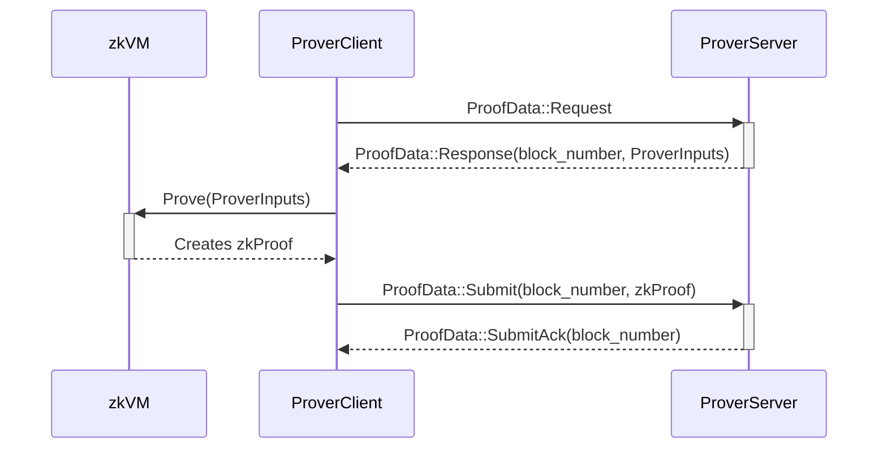

# ethrex L2 Prover

## ToC

- [ethrex L2 Prover](#ethrex-l2-prover)
  - [ToC](#toc)
  - [What](#what)
  - [Workflow](#workflow)
  - [How](#how)
    - [Quick Test](#quick-test)
    - [Dev Mode](#dev-mode)
      - [Run the whole system with the prover](#run-the-whole-system-with-the-prover)
    - [GPU mode](#gpu-mode)
      - [Proving Process Test](#proving-process-test)
      - [Run the whole system with a GPU Prover](#run-the-whole-system-with-a-gpu-prover)
  - [Configuration](#configuration)

> [!NOTE]
> The shipping/deploying process and the `Prover` itself are under development.

## What

The prover consists of two main components: handling incoming proving data from the `L2 proposer`, specifically the `prover_server` component, and the `zkVM`. The `prover_client` is responsible for this first part, while the `zkVM` serves as a RISC-V emulator executing code specified in `crates/l2/prover/zkvm/interface/guest/src`.
Before the `zkVM` code (or guest), there is a directory called `interface`, which indicates that we access the `zkVM` through the "interface" crate.

In summary, the `prover_client` manages the inputs from the `prover_server` and then "calls" the `zkVM` to perform the proving process and generate the `groth16` ZK proof.

## Workflow

The `Prover Server` monitors requests for new jobs from the `Prover Client`, which are sent when the prover is available. Upon receiving a new job, the Prover generates the proof, after which the `Prover Client` sends the proof back to the `Prover Server`.



## How

**Dependencies:**

- [RISC0](https://dev.risczero.com/api/zkvm/install)
  1. `curl -L https://risczero.com/install | bash`
  2. `rzup install cargo-risczero 1.2.0`
- [SP1](https://docs.succinct.xyz/docs/sp1/introduction)
  1. `curl -L https://sp1up.succinct.xyz | bash`
  2. `sp1up --version 4.1.0`
- [Pico](https://docs.brevis.network/)
  1. `cargo +nightly install --git https://github.com/brevis-network/pico pico-cli`
  2. `rustup install nightly-2024-11-27`
  3. `rustup component add rust-src --toolchain nightly-2024-11-27`
- [SOLC](https://docs.soliditylang.org/en/latest/installing-solidity.html)

After installing the toolchains, a quick test can be performed to check if we have everything installed correctly.

#### Quick Test

To test the `zkvm` execution quickly, the following test can be run:

```sh
cd crates/l2/prover
```

Then run any of the targets:

- `make perf-pico`
- `make perf-risc0`
- `make perf-sp1`

### Dev Mode

To run the blockchain (`proposer`) and prover in conjunction, start the `prover_client`, use the following command:

```sh
make init-prover T="prover_type (pico,risc0,sp1,exec) G=true"
```

select the "exec" backend whenever it's not desired to generate proofs, like in a CI environment.

#### Run the whole system with the prover

1. `cd crates/l2`
2. `make rm-db-l2 && make down`
   - It will remove any old database, if present, stored in your computer. The absolute path of libmdbx is defined by [data_dir](https://docs.rs/dirs/latest/dirs/fn.data_dir.html).
3. `cp config_example.toml config.toml` &rarr; check if you want to change any config.
4. `make init`
   - Make sure you have the `solc` compiler installed in your system.
   - Init the L1 in a docker container on port `8545`.
   - Deploy the needed contracts for the L2 on the L1.
   - Start the L2 locally on port `1729`.
5. In a new terminal &rarr; `make init-prover T=(risc0 or sp1)`.

After this initialization we should have the prover running in `dev_mode` &rarr; No real proofs.

### GPU mode

**Steps for Ubuntu 22.04 with Nvidia A4000:**

1. Install `docker` &rarr; using the [Ubuntu apt repository](https://docs.docker.com/engine/install/ubuntu/#install-using-the-repository)
   - Add the `user` you are using to the `docker` group &rarr; command: `sudo usermod -aG docker $USER`. (needs reboot, doing it after CUDA installation)
   - `id -nG` after reboot to check if the user is in the group.
2. Install [Rust](https://www.rust-lang.org/tools/install)
3. Install [RISC0](https://dev.risczero.com/api/zkvm/install)
4. Install [CUDA for Ubuntu](https://developer.nvidia.com/cuda-downloads?target_os=Linux&target_arch=x86_64&Distribution=Ubuntu&target_version=22.04&target_type=deb_local)
   - Install `CUDA Toolkit Installer` first. Then the `nvidia-open` drivers.
5. Reboot
6. Run the following commands:

```sh
sudo apt-get install libssl-dev pkg-config libclang-dev clang
echo 'export PATH=/usr/local/cuda/bin:$PATH' >> ~/.bashrc
echo 'export LD_LIBRARY_PATH=/usr/local/cuda/lib64:$LD_LIBRARY_PATH' >> ~/.bashrc
```

#### Proving Process Test

To test the `zkvm` proving process using a `gpu` quickly, the following test can be run:

```sh
cd crates/l2/prover
```

Then run any of the targets:

- `make perf-pico-gpu`
- `make perf-risc0-gpu`
- `make perf-sp1-gpu`

#### Run the whole system with a GPU Prover

Two servers are required: one for the `prover` and another for the `proposer`. If you run both components on the same machine, the `prover` may consume all available resources, leading to potential stuttering or performance issues for the `proposer`/`node`.

1. `prover_client`/`zkvm` &rarr; prover with gpu, make sure to have all the required dependencies described at the beginning of [Gpu Mode](#gpu-mode) section.
   1. `cd ethrex/crates/l2`
   2. `cp config_example.toml config.toml` and change the `prover_server_endpoint` entry under the [prover.client] section with the ip of the other server.

The important variables are:

```sh
[prover.client]
prover_server_endpoint=<ip-address>:3000
```

- `Finally`, to start the `prover_client`/`zkvm`, run:
  - `make init-prover T=(risc0 or sp1) G=true`

2. `prover_server`/`proposer` &rarr; this server just needs rust installed.
   1. `cd ethrex/crates/l2`
   2. `cp config_example.toml config.toml` and change the addresses and the following fields:
      - [prover.server]
        `listen_ip=0.0.0.0` &rarr; used to handle the tcp communication with the other server.
      - The `COMMITTER` and `PROVER_SERVER_VERIFIER` must be different accounts, the `DEPLOYER_ADDRESS` as well as the `L1_WATCHER` may be the same account used by the `COMMITTER`.
      - [deployer]
        - `salt_is_zero=false` &rarr; set to false to randomize the salt.
      - `sp1_deploy_verifier = true` overwrites `sp1_contract_verifier`. Check if the contract is deployed in your preferred network or set to `true` to deploy it.
      - `risc0_contract_verifier = 0xd9b0d07CeCd808a8172F21fA7C97992168f045CA` &rarr; risc0’s verifier contract deployed on Sepolia. (Check the if the contract is deployed in your preferred network). An analog variable called `sp1_contract_verifier` exists for SP1.
      - Set the [eth] `rpc_url` to any L1 endpoint.

> [!NOTE]
> Make sure to have funds, if you want to perform a quick test `0.2[ether]` on each account should be enough.

- `Finally`, to start the `proposer`/`l2 node`, run:
  - `make rm-db-l2 && make down`
  - `make deploy-l1 && make init-l2`

## Configuration

The following environment variables are available to configure the prover:

- `PROVER_SERVER_LISTEN_IP`: IP used to start the Server.
- `PROVER_SERVER_LISTEN_PORT`: Port used to start the Server.
- `PROVER_CLIENT_PROVER_SERVER_ENDPOINT`: Prover Server's Endpoint used to connect the Client to the Server.
- `PROVER_SERVER_VERIFIER_ADDRESS`: The address of the account that sends the zkProofs on-chain and interacts with the `OnChainProposer` `verify()` function.
- `PROVER_SERVER_VERIFIER_PRIVATE_KEY`: The private key of the account that sends the zkProofs on-chain and interacts with the `OnChainProposer` `verify()` function.

> [!NOTE]
> The `PROVER_SERVER_VERIFIER` account must differ from the `COMMITTER_L1` account.
