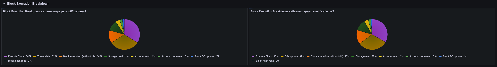

# Ethrex L1 Performance Dashboard (Oct 2025)

Our Grafana dashboard provides a comprehensive overview of key metrics to help developers and operators ensure optimal performance and reliability of their Ethrex nodes. The only configured datasource today is `prometheus`, and the `job` variable defaults to `ethrex L1`, which is the job configured by default in our provisioning.

## How to use it
Use the `network` variable (discovered via the consensus config metric) to scope the view by network, then pick one or more `instance` entries. Every panel honors these selectors. Tip: several panels rely on Grafana transforms such as Organize fields, Join by field, Filter by value, and Group by—keep those in mind if you customize the layout.

## Execution and consensus summary

### Execution Client
Confirms the execution client name and build that each monitored instance is running so you can spot mismatched deployments quickly.

### Consensus Config
Shows the consensus configuration reported by `ethereum-metrics-exporter`, helping you verify which network the node is running.

### Consensus Fork
Highlights the active fork reported by `ethereum-metrics-exporter`, which is a useful signal during planned upgrades.

## Block processing

Row panels showing key block processing metrics across all selected instances.

### Gas Used %
Tracks how much of the block gas limit is consumed across instances, surfacing heavy traffic or underfilled blocks at a glance.

### Ggas/s
Charts gigagas per second to compare execution throughput between nodes and reveal sustained load versus isolated spikes.

### Block Height
Plots the head block seen by each instance so you can immediately detect stalled sync or lagging nodes.

### Ggas/s by Block
Scatter view that ties throughput to the specific block number once all selected instances agree on the same head, making block-level investigations straightforward.

_**Limitations**: This panel only shows data when all selected instances agree on the same head block, and it doesn't handle reorgs gracefully. Here are a couple of things to have in mind when looking at it:_
- During reorgs, we might see weird shapes in the data, with lines at a certain block connected to past ones when more than one slot reorgs happen.
- We could see double measurements for the same block number if reorgs on the same block occur.
- Mean could vary when adding or removing instances, as only blocks agreed upon by all selected instances are shown.

### Block Time
Estimates per-block execution time and lines it up with block numbers, helping you correlate latency spikes with particular blocks.

_**Limitations**: This panel has the same limitations as the "Ggas/s by Block" panel above, as it relies on the same logic to align blocks across instances._

## Block execution breakdown

This row repeats a pie chart for each instance showing how execution time splits between storage reads, account reads, and non-database work so you can confirm performance tuning effects.

## Process and server info

Row panels showing process-level and host-level metrics to help you monitor resource usage and spot potential issues.

### Uptime
Displays time since the Ethrex process started. _[need proper instance labels]_ 

### Threads
Shows the number of tokio process threads in use. _[need proper instance labels]_

### Open FDs
Reports current file descriptor usage so you can compare against limits. _[need proper instance labels]_

### Open FDs Historic
Time-series view of descriptor usage to spot gradual leaks or sudden bursts tied to workload changes.

### Datadir Size
Tracks database footprint growth, helping you plan disk needs and confirming pruning/compaction behavior.

### Node CPU (avg. cores used)
Shows effective CPU cores consumed by each instance, separating sustained computation from short-lived bursts.

### Node Memory (RSS)
Follows the resident memory footprint of the Ethrex process so you can investigate leaks or pressure.

### Host CPU Utilization (%)
Uses node exporter metrics to track whole-host CPU load and distinguish client strain from other processes on the server.

### Host RAM (GiB) - Used vs Total
Compares used versus total RAM to highlight when machines approach memory limits and need attention.

## Block building (WIP)

This collapsed row offers a combined view of the block building base fee, gigagas per second during payload construction, and the time the builder spends assembling blocks. These panels are works in progress, collapsed by default, and may be refined over time.

