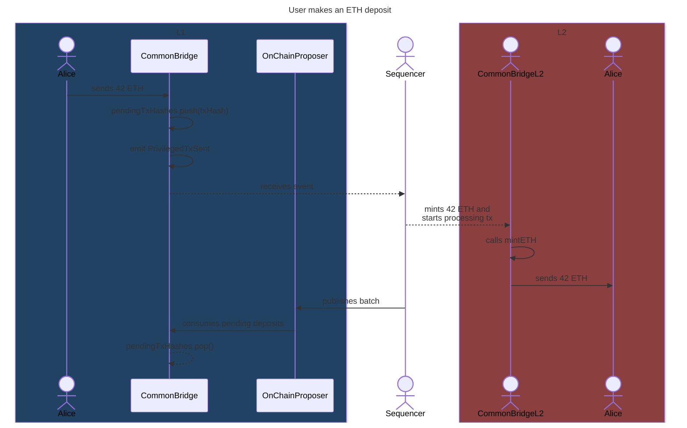
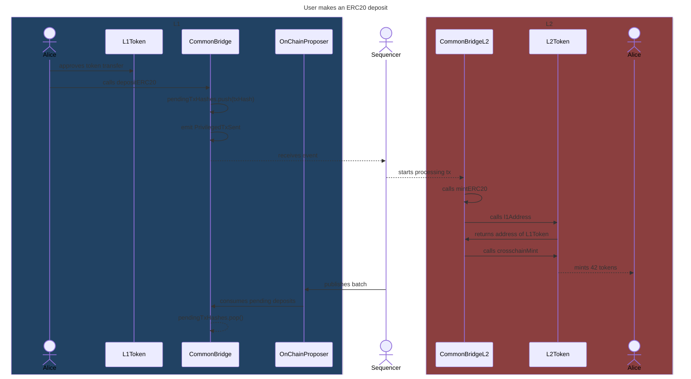
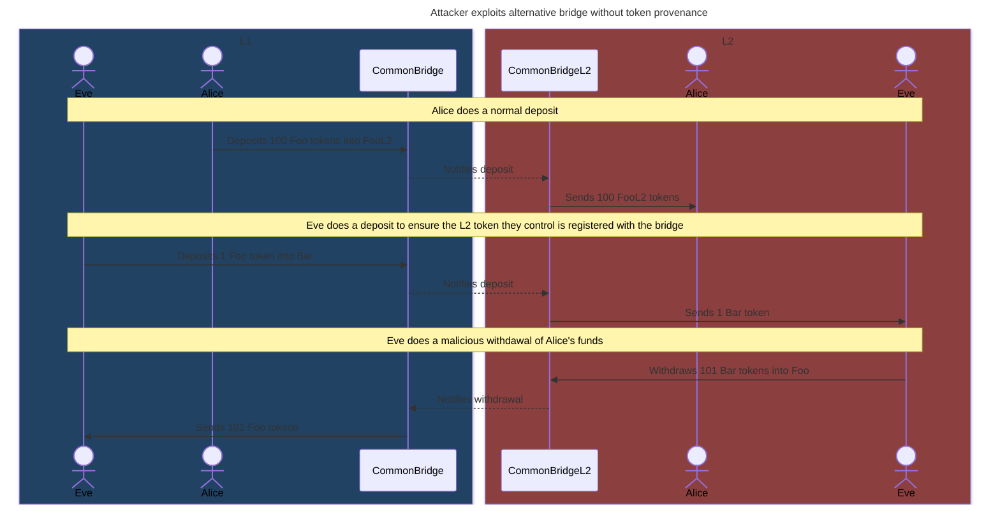

# Deposits

This document contains a detailed explanation of how asset deposits work.

## Native ETH deposits

This section explains step by step how native ETH deposits work.

On L1:

1. The user sends ETH to the `CommonBridge` contract.
   Alternatively, they can also call `deposit` and specify the address to receive the deposit in (the `l2Recipient`).
2. The bridge adds the deposit's hash to the `pendingTxHashes`.
   We explain how to compute this hash in ["Generic L1->L2 messaging"](#generic-l1-l2-messaging)
3. The bridge emits a `PrivilegedTxSent` event:

    ```solidity
    bytes memory callData = abi.encodeCall(ICommonBridgeL2.mintETH, (l2Recipient));

    emit PrivilegedTxSent(
        0xffff,         // sender in L2 (the L2 bridge)
        0xffff,         // to (the L2 bridge)
        transactionId,
        msg.value,      // value
        gasLimit,
        callData
    );
    ```

Off-chain:

1. On each L2 node, the L1 watcher processes `PrivilegedTxSent` events, each adding a `PrivilegedL2Transaction` to the L2 mempool.
2. The privileged transaction is an [EIP-2718 typed transaction](https://eips.ethereum.org/EIPS/eip-2718), somewhat similar to an [EIP-1559 transaction](https://eips.ethereum.org/EIPS/eip-1559), but with some changes.
   For this case, the important difference is that the sender of the transaction is set by our L1 bridge.
   This enables our L1 bridge to "forge" transactions from any sender, even arbitrary addresses like the L2 bridge.
3. Privileged transactions sent by the L2 bridge don't deduct from the bridge's balance their value.
   In practice, this means ETH equal to the transactions `value` is minted.

On L2:

1. The privileged transaction calls `mintETH` on the `CommonBridgeL2` with the intended recipient as parameter.
2. The bridge verifies the sender is itself, which can only happen for deposits sent through the L1 bridge.
3. The bridge sends the minted ETH to the recipient.
   In case of failure, it initiates an ETH withdrawal for the same amount.

Back on L1:

1. A sequencer commits a batch on L1 including the privileged transaction.
2. The `OnChainProposer` asserts the included privileged transactions exist and are included in order.
3. The `OnChainProposer` notifies the bridge of the consumed privileged transactions and they are removed from `pendingTxHashes`.



## ERC20 deposits through the native bridge

This section explains step by step how native ERC20 deposits work.

On L1:

1. The user gives the `CommonBridge` allowance via an `approve` call to the L1 token contract.
2. The user calls `depositERC20` on the bridge, specifying the L1 and L2 token addresses, the amount to deposit, along with the intended L2 recipient.
3. The bridge locks the specified L1 token amount in the bridge, updating the mapping with the amount locked for the L1 and L2 token pair.
   This ensures that L2 token withdrawals don't consume L1 tokens that weren't deposited into that L2 token (see ["Why store the provenance of bridged tokens?"](#why-store-the-provenance-of-bridged-tokens) for more information).
4. The bridge emits a `PrivilegedTxSent` event:

    ```solidity
    emit PrivilegedTxSent(
        0,            // amount (unused)
        0xffff,       // to (the L2 bridge)
        depositId,
        0xffff,       // sender in L2 (the L2 bridge)
        gasLimit,
        callData
    );
    ```

Off-chain:

1. On each L2 node, the L1 watcher processes `PrivilegedTxSent` events, each adding a `PrivilegedL2Transaction` to the L2 mempool.
2. The privileged transaction is an [EIP-2718 typed transaction](https://eips.ethereum.org/EIPS/eip-2718), somewhat similar to an [EIP-1559 transaction](https://eips.ethereum.org/EIPS/eip-1559), but with some changes.
   For this case, the important differences is that the sender of the transaction is set by our L1 bridge.
   This enables our L1 bridge to "forge" transactions from any sender, even arbitrary addresses like the L2 bridge.

On L2:

1. The privileged transaction performs a call to `mintERC20` on the `CommonBridgeL2` from the L2 bridge's address, specifying the address of the L1 and L2 tokens, along with the amount and recipient.
2. The bridge verifies the sender is itself, which can only happen for deposits sent through the L1 bridge.
3. The bridge calls `l1Address()` on the L2 token, to verify it matches the received L1 token address.
4. The bridge calls `crosschainMint` on the L2 token, minting the specified amount of tokens and sending them to the L2 recipient.
   In case of failure, it initiates an ERC20 withdrawal for the same amount.

Back on L1:

1. A sequencer commits a batch on L1 including the privileged transaction.
2. The `OnChainProposer` asserts the included privileged transactions exist and are included in order.
3. The `OnChainProposer` notifies the bridge of the consumed privileged transactions and they are removed from `pendingTxHashes`.



### Why store the provenance of bridged tokens?

As said before, storing the provenance of bridged tokens or, in other words, how many tokens were sent from each L1 token to each L2 token, ensures that L2 token withdrawals don't unlock L1 tokens that weren't deposited into another L2 token.

This can be better understood with an example:



## Generic L1->L2 messaging

<!-- TODO: extend this version once we have generic L1->L2 messages -->

Privileged transactions are signaled by the L1 bridge through `PrivilegedTxSent` events.
These events are emitted by the `CommonBridge` contract on L1 and processed by the L1 watcher on each L2 node.

```solidity
event PrivilegedTxSent (
    address indexed from,
    address indexed to,
    uint256 indexed transactionId,
    uint256 value,
    uint256 gasLimit,
    bytes data
);
```

As seen before, this same event is used for native deposits, but with the `from` artificially set to the L2 bridge address, which is also the `to` address.

For tracking purposes, we might want to know the hash of the L2 transaction.
We can compute it as follows:

```solidity
keccak256(
    bytes.concat(
        bytes20(from),
        bytes20(to),
        bytes32(transactionId),
        bytes32(value),
        bytes32(gasLimit),
        keccak256(data)
    )
)
```
