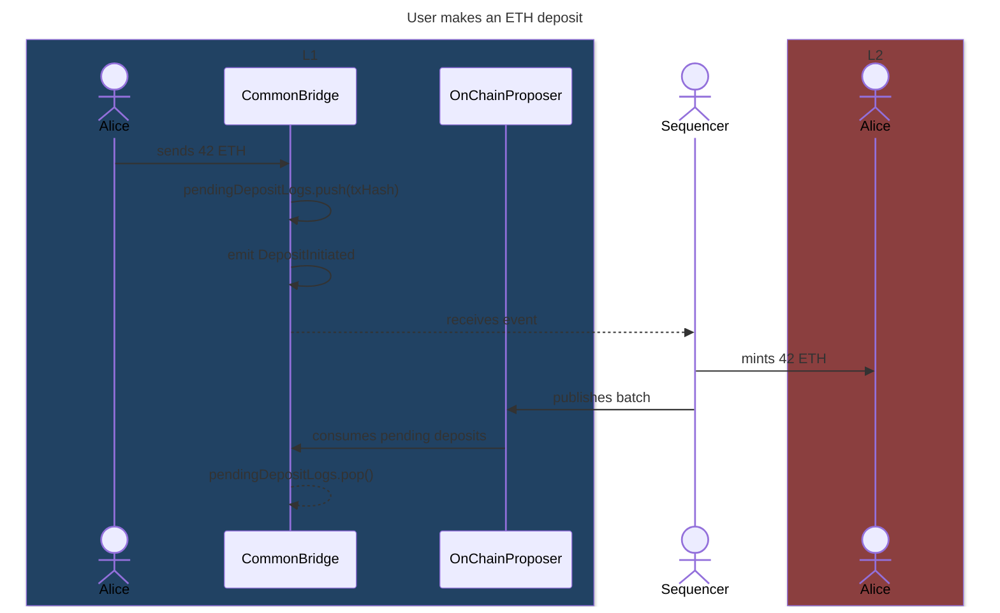
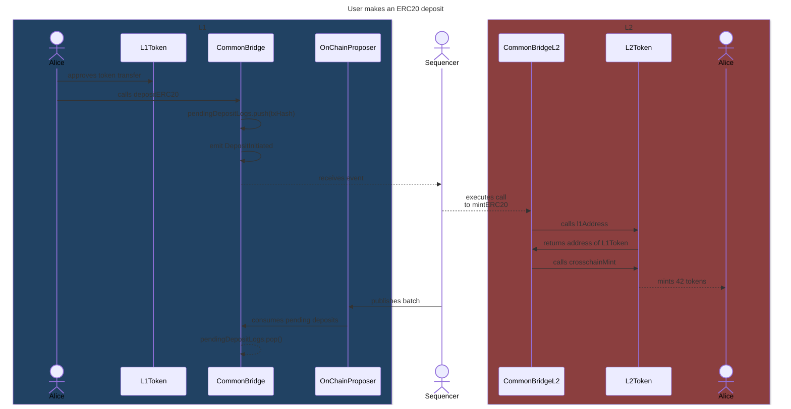
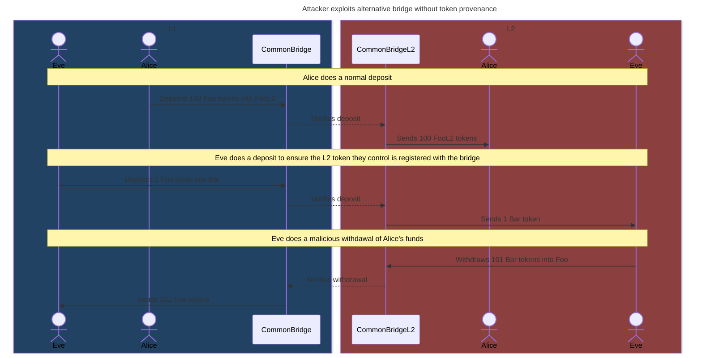

# Deposits

This document contains a detailed explanation of how asset deposits work.

## Native ETH deposits

This section explains step by step how native ETH deposits work.

On L1:

1. The user sends ETH to the `CommonBridge` contract.
2. The bridge adds the deposit's hash to the `pendingDepositLogs`.
   We explain how to compute this hash in ["Generic L1->L2 messaging"](#generic-l1-l2-messaging)
3. The bridge emits a `DepositInitiated` event:

    ```solidity
    emit DepositInitiated(
        msg.value,   // amount
        msg.sender,  // to
        depositId,
        msg.sender,  // recipient of the deposit
        msg.sender,  // sender in L2
        21000 * 5,   // gas limit
        "",          // calldata
        l2MintTxHash
    );
    ```

Off-chain:

1. On each L2 node, the L1 watcher processes `DepositInitiated` events, each adding a `PrivilegedL2Transaction` to the L2 mempool.
2. The privileged transaction is an [EIP-2718 typed transaction](https://eips.ethereum.org/EIPS/eip-2718), somewhat similar to an [EIP-1559 transaction](https://eips.ethereum.org/EIPS/eip-1559), but with the following changes:
   1. They don't have sender signatures. Those are validated in the L1, since the sender of the L1 deposit transaction is the sender in the L2.
      As a consequence of this, privileged transactions can also be sent from L1 contracts.
   2. At the start of the execution, the `recipient` account balance is increased by the transaction's value. The transaction's value is set to zero during the rest of the execution.
   3. The sender account's nonce isn't increased as a result of the execution.
   4. The sender isn't charged for the gas costs of the execution.

On L2:

1. The privileged transaction increases the account balance of the recipient by the deposit amount.
2. Additionally, a call to the sender address is executed, which immediately halts in case the sender is an EOA.
   In case the call reverts, changes from the execution are reverted as normal, but the initial balance increase is kept.

Back on L1:

1. A sequencer commits a batch on L1 including the privileged transaction.
2. The `OnChainProposer` asserts the included privileged transactions exist and are included in order.
3. The `OnChainProposer` notifies the bridge of the consumed privileged transactions and they are removed from `pendingDepositLogs`.



## ERC20 deposits through the native bridge

This section explains step by step how native ERC20 deposits work.

On L1:

1. The user gives the `CommonBridge` allowance via an `approve` call to the L1 token contract.
2. The user calls `depositERC20` on the bridge, specifying the L1 and L2 token addresses, the amount to deposit, along with the intended L2 recipient.
3. The bridge locks the specified L1 token amount in the bridge, updating the mapping with the amount locked for the L1 and L2 token pair.
   This ensures that L2 token withdrawals don't consume L1 tokens that weren't deposited into that L2 token (see ["Why store the provenance of bridged tokens?"](#why-store-the-provenance-of-bridged-tokens) for more information).
4. The bridge emits a `DepositInitiated` event:

    ```solidity
    emit DepositInitiated(
        0,            // amount (unused)
        0xffff,       // to (the L2 bridge)
        depositId,
        0,            // recipient of the ETH deposit (unused)
        0xffff,       // sender in L2 (the L2 bridge)
        gasLimit,     // gas limit
        data,         // calldata
        l2MintTxHash
    );
    ```

On L2:

1. The privileged transaction performs a call to `mintERC20` on the `CommonBridgeL2` from the L2 bridge's address, specifying the address of the L1 and L2 tokens, along with the amount and recipient.
2. The bridge calls `crosschainMint` on the L2 token, minting the specified amount of tokens and sending them to the L2 recipient.
3. If the call reverts, the L2 bridge automatically initiates a withdrawal.

Back on L1:

1. A sequencer commits a batch on L1 including the privileged transaction.
2. The `OnChainProposer` asserts the included privileged transactions exist and are included in order.
3. The `OnChainProposer` notifies the bridge of the consumed privileged transactions and they are removed from `pendingDepositLogs`.



### Why store the provenance of bridged tokens?

As said before, storing the provenance of bridged tokens or, in other words, how many tokens were sent from each L1 token to each L2 token, ensures that L2 token withdrawals don't unlock L1 tokens that weren't deposited into another L2 token.

This can be better understood with an example:



## Generic L1->L2 messaging

<!-- TODO: extend this version once we have generic L1->L2 messages -->

Privileged transactions are sent as a `DepositInitiated` event.

```solidity
emit DepositInitiated(
    amount,
    to,
    depositId,
    recipient,
    from,
    gasLimit,
    calldata,
    l2MintTxHash
);
```

The `l2MintTxHash` is the hash of the privileged transaction, computed as follows:

```solidity
keccak256(
    bytes.concat(
        bytes20(to),
        bytes32(value),
        bytes32(depositId),
        bytes20(recipient),
        bytes20(from),
        bytes32(gasLimit),
        keccak256(calldata)
    )
)
```
