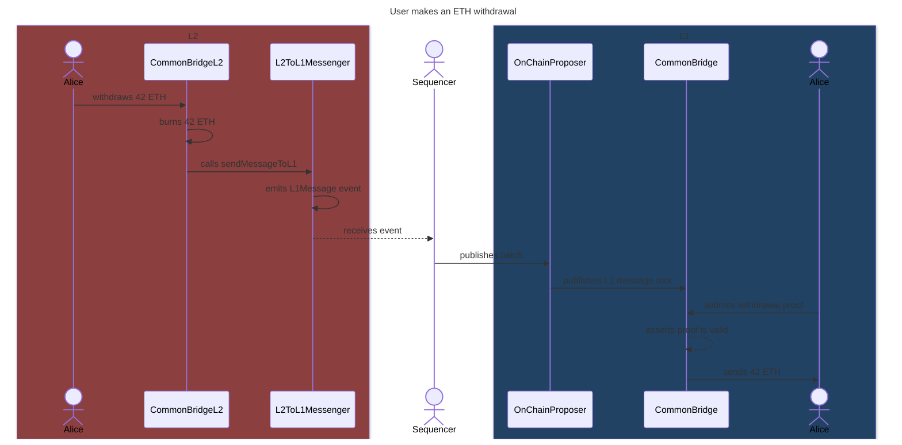
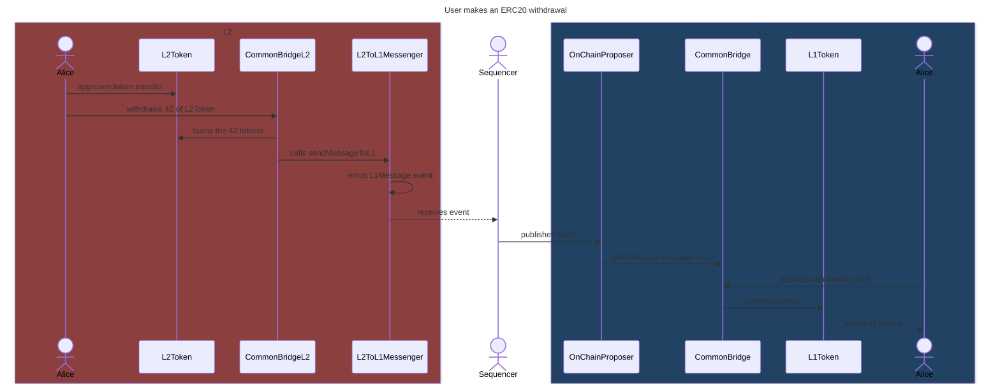
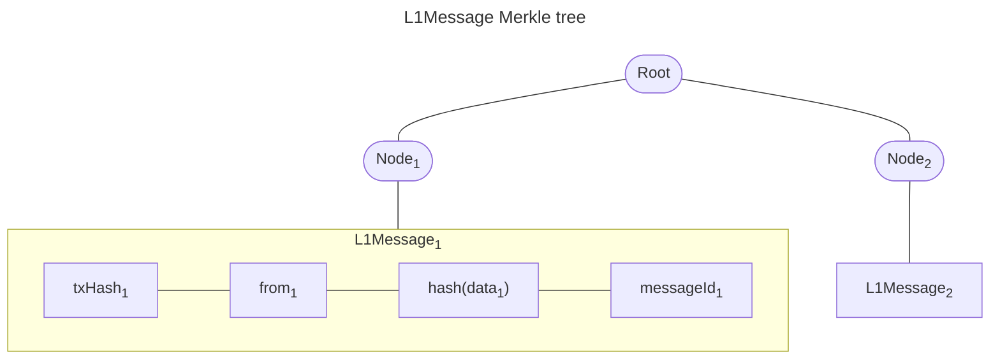

# Withdrawals

This document contains a detailed explanation of how asset withdrawals work.

## Native ETH withdrawals

This section explains step by step how native ETH withdrawals work.

On L2:

1. The user sends a transaction calling `withdraw(address _receiverOnL1)` on the `CommonBridgeL2` contract, along with the amount of ETH to be withdrawn.
2. The bridge sends the withdrawn amount to the burn address.
3. The bridge calls `sendMessageToL1(bytes32 data)` on the `L2ToL1Messenger` contract, with `data` being:

    ```solidity
    bytes32 data = keccak256(abi.encodePacked(ETH_ADDRESS, ETH_ADDRESS, _receiverOnL1, msg.value))
    ```

    The `ETH_ADDRESS` is an arbitrary address we use, meaning the "token" to transfer is ETH.

4. `L2ToL1Messenger` emits an `L1Message` event, with the address of the L2 bridge contract and `data` as topics, along with a unique message ID.

Off-chain:

1. On each L2 node, the L1 watcher extracts `L1Message` events, generating a merkle tree with the hashed messages as leaves.
   The merkle tree format is explained in the ["`L1Message` Merkle tree"](#l1message-merkle-tree) section below.

On L1:

1. A sequencer commits the batch on L1, publishing the merkle tree's root with `publishWithdrawals` on the L1 `CommonBridge`.
2. The user submits a withdrawal proof when calling `claimWithdrawal` on the L1 `CommonBridge`.
   The proof can be obtained by calling `ethrex_getWithdrawalProof` in any L2 node, after the batch containing the withdrawal transaction was verified in the L1.
3. The bridge asserts the proof is valid and wasn't previously claimed.
4. The bridge sends the locked funds specified in the `L1Message` to the user.



## ERC20 withdrawals through the native bridge

This section explains step by step how native ERC20 withdrawals work.

On L2:

1. The user calls `approve` on the L2 tokens to allow the bridge to transfer the asset.
2. The user sends a transaction calling `withdrawERC20(address _token, address _receiverOnL1, uint256 _value)` on the `CommonBridgeL2` contract.
3. The bridge calls `crosschainBurn` on the L2 token, burning the amount to be withdrawn by the user.
4. The bridge fetches the address of the L1 token by calling `l1Address()` on the L2 token contract.
5. The bridge calls `sendMessageToL1(bytes32 data)` on the `L2ToL1Messenger` contract, with `data` being:

    ```solidity
    bytes32 data = keccak256(abi.encodePacked(_token.l1Address(), _token, _receiverOnL1, _value))
    ```

6. `L2ToL1Messenger` emits an `L1Message` event, with the address of the L2 bridge contract and `data` as topics, along with a unique message ID.

Off-chain:

1. On each L2 node, the L1 watcher extracts `L1Message` events, generating a merkle tree with the hashed messages as leaves.
   The merkle tree format is explained in the ["`L1Message` Merkle tree"](#l1message-merkle-tree) section below.

On L1:

1. A sequencer commits the batch on L1, publishing the `L1Message` with `publishWithdrawals` on the L1 `CommonBridge`.
2. The user submits a withdrawal proof when calling `claimWithdrawalERC20` on the L1 `CommonBridge`.
   The proof can be obtained by calling `ethrex_getWithdrawalProof` in any L2 node, after the batch containing the withdrawal transaction was verified in the L1.
3. The bridge asserts the proof is valid and wasn't previously claimed, and that the locked tokens mapping contains enough balance for the L1 and L2 token pair to cover the transfer.
4. The bridge transfers the locked tokens specified in the `L1Message` to the user and discounts the transferred amount from the L1 and L2 token pair in the mapping.



## Generic L2->L1 messaging

First, we need to understand the generic mechanism behind it:

### `L1Message`

To allow generic L2->L1 messages, a system contract is added which allows sending arbitrary data. This data is emitted as `L1Message` events, which nodes automatically extract from blocks.

```rust
struct L1Message {
    tx_hash: H256,    // L2 transaction where it was included
    from: Address,    // Who sent the message in L2
    data_hash: H256,  // Hashed payload
    message_id: U256, // Unique message ID
}
```

### `L1Message` Merkle tree

When sequencers commit a new batch, they include the merkle root of all the `L1Message`s inside the batch.
That way, L1 contracts can verify some data was sent from a specific L2 sender.



As shown in the diagram, the leaves of the tree are the hash of each encoded `L1Message`.
Messages are encoded by packing, in order:

- the transaction hash that generated it in the L2
- the address of the L2 sender
- the hashed data attached to the message
- the unique message ID

### Bridging

On the L2 side, for the case of asset bridging, a contract burns some assets.
It then sends a message to the L1 containing the details of this operation:

- From: L2 token address that was burnt
- To: L1 token address that will be withdrawn
- Destination: L1 address that can claim the deposit
- Amount: how much was burnt

When the batch is committed on the L1, the `OnChainProposer` notifies the bridge which saves the message tree root.
Once the batch containing this transaction is verified, the user can claim their funds on the L1.
To do this, they compute a merkle proof for the included batch and call the L1 `CommonBridge` contract.

This contract then:

- Checks that the batch is verified
- Ensures the withdrawal wasn't already claimed
- Computes the expected leaf
- Validates that the proof leads from the leaf to the root of the message tree
- Gives the funds to the user
- Marks the withdrawal as claimed
